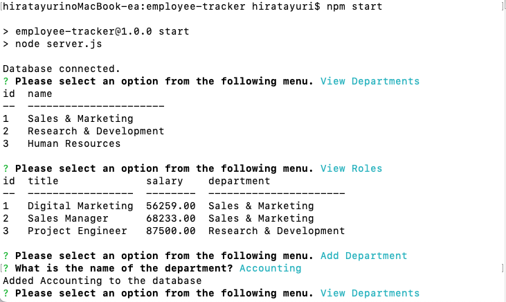
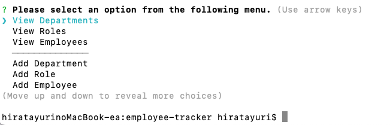

# KTN Employee Manager
[](https://opensource.org/licenses/MIT)

## Description
This app is perfect for viewing and managing the departments, roles, and employees in your company! It will definitely help you organize and plan your business with just the command line prompt! 😼✨<br/>

< Sample image >

< Demo Video ><br/>
   - [Part 1](https://drive.google.com/file/d/1v20pF1Eu47Nx8iKgb1xeP6aUJylTOdpS/view)
   - [Part 2]() ***← NEW!***

## Table of Contents
- [Installation](#installation)
- [Usage](#usage)
- [License](#license)
- [Questions](#questions)

## Installation
1. install node and MySQL
2. ```
   npm i
   ```

## Usage
1. Rename `.env.EXAMPLE` file to `.env` and enter your MySQL username and password in the file.
2. Create database by executing the following code after logging into MySQL server.
   ```
   source ./db/db.sql;
   source ./db/schema.sql;
   ```
   * You can use `seeds.sql` file to register multiple data BUT for employees, only after roles and managers are registered.
3. Start app.
   ```
   npm start
   ```
4. Select option using up and down arrows.
<br/>
   [ Options ]
   - View Departments
   - View Roles
   - View Employees
   - View Employees by Manager ***← NEW!***
   - View Employees by Department ***← NEW!***
   - View Department Budget (shows sum of all employees' salary in each department) ***← NEW!***

   ---

   - Add Department
   - Add Role
   - Add Employee

   ---

   - Update Employee Role
   - Update Employee Manager ***← NEW!***
   - Delete Department ***← NEW!***
   - Delete Role ***← NEW!***
   - Delete Employee ***← NEW!***
5. For the add, update, delete options, answer all the questions.
6. Use `Ctrl` + `c` to end.

## License
Licensed under the [MIT License](https://opensource.org/licenses/MIT).
      

## Questions
- GitHub Profile: https://github.com/YuriI92
- If you have any additional questions, please feel free to contact me by email.
  E-mail Address: <yurichikawa1992@gmail.com>
      
  